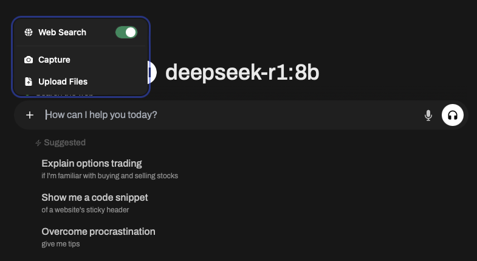
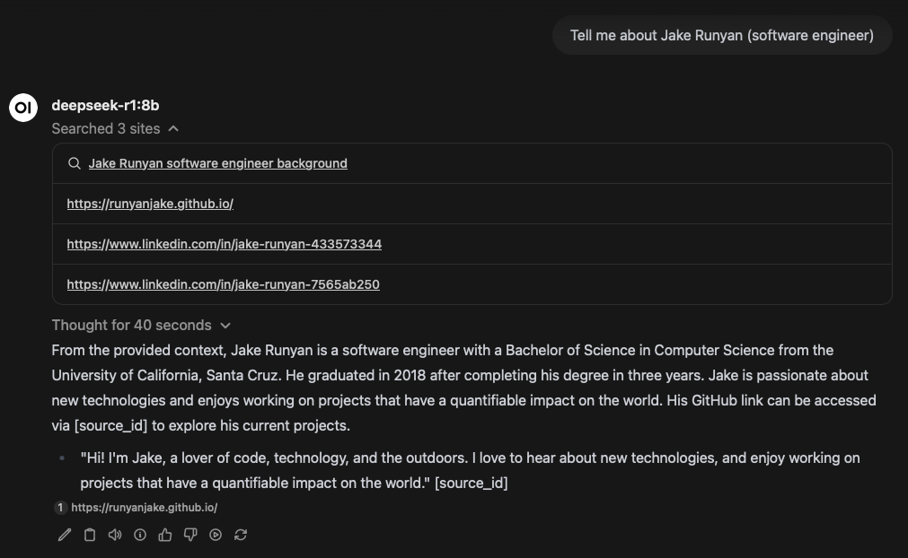
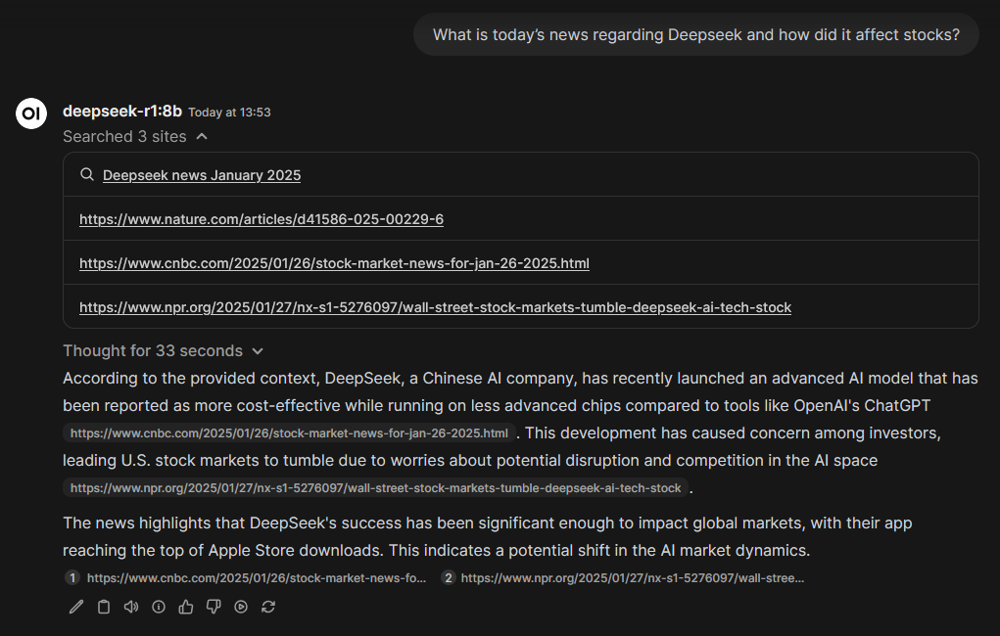

# Pure RL with DeepSeek
So apparently pure reinforcement learning is the move. The new DeepSeek models out of China throw modern LLM training 
techniques out in favor of just purely using RL over more time and over more data to produce better models than the more bespoke methods.

# Open Source Stacks Rock!
I've experienced it once before with [ComfyUI](https://jake.runyan.dev/blog/sdxl-pipeline), but it seems like with AI the open source 
community has really been putting in the work so those like me looking to start some passion projects can quicken their development cycles.

[OpenWebUI](https://github.com/ml-explore/OpenWebUI) is a great frontend UI for interacting with models. Some of their docker containers
come bundled with Ollama, which means the setup is literally as simple as building a super standard docker container with it. 

OpenWebUI also has the ability to allow for Web Search. In a departure from previous attempts, it seems to be possible to throw together
a few free and/or open source components together to make a compelling attempt at web search.

Because DeepSeek responds in a very specific and waffle-y way, it's not very well suited for being the model we use to generate our 
search query. In its place, Llama3.2 is a suitable replacement as it's better with direct instructions like our ask to make the query.

# Giving it a Shot

## DeepSeek
This is the new LLM model out of China that's been said to have pretty good code gen abilities, and the main reason I started looking 
at setting up this stack for myself. I've done previous attempts at self-hosting coding assistants, but found that the juice wasn't
worth the squeeze, as they say. 

For this experiment I was looking at the 1.5b and 8b models for `deepseek-r1`, though the coding assistant model `deepseek-coder` is also available.

## My Experience 
Man, it was pretty good. I've got a smaller GPU on PWS so I was limited to running the 8b model, but responses were good. I noticed
the best response times on the 1.5b model, and for some easier tasks the correctness between the two was hard to discern.

### Search
I particularly liked the features of OpenWebUI to allow for web search, which from initial testing seemed to find good results to build
context of the response with.

Some responses with web search are a little on the nose with the smaller models, for example a search about me gives results that are pulled 
verbatim from my github profile and websites.

For best results, the setup I have been using is Llama3.2 for generating search queries.  
Search is done through the Google Programmable Search Engine (See [Here](https://docs.openwebui.com/tutorials/integrations/web_search/#google-pse-api) for instructions.)
And the model of choice for the response is Deepseek-r1:8b.

# Final Thoughts
I'm still actively using chatgpt, claude, and others for coding work, but as local LLMs improve you can bet I'll be keeping up to date with this stack. 

## Resources
[OpenWebUI](https://github.com/ml-explore/OpenWebUI)  
[Deepseek with Ollama](https://ollama.ai/library/deepseek-coder)  
Thank you to [DWS](https://dws.rip) for collaboration  

